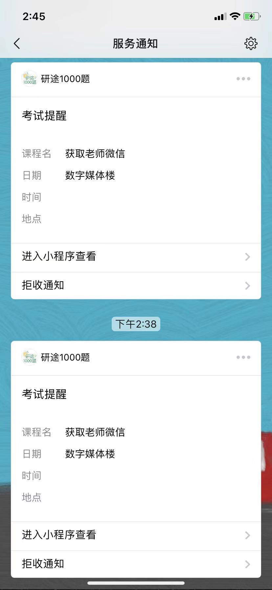
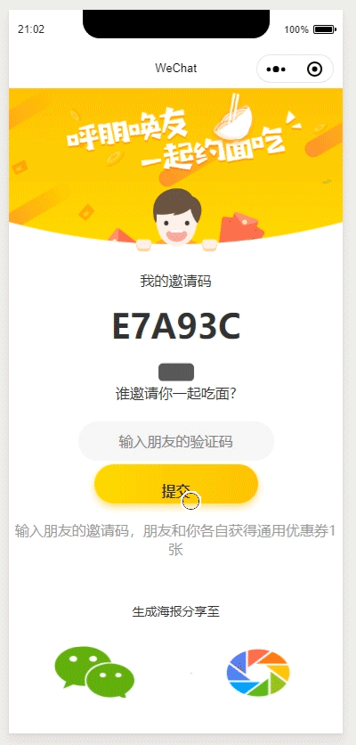

## Peak-pan 小程序的集合

视频教程：https://www.bilibili.com/video/av11938917/

## 1.【微信小程序 - 快递查询 】快递查询


## 2.【微信小程序 - springboot后台获取用户的openid】

### 参考链接
https://www.cnblogs.com/to-red/p/11563854.html

https://blog.csdn.net/yanpengfeil/article/details/85982935

openid可以标识一个用户，session_key会变
执行1次

```
获取到code：011iPsLJ1iD6J30VoGMJ1o9nLJ1iPsLn
{"session_key":"ZtCCWMiD32uwzjpcEaQpMQ==",
"openid":"HuPj5EnG_ISAlXH3W6Bh_xMlHKA"}
oHuPj5EnG_ISAlXH3W6Bh_xMlHKA
Creating a new SqlSession
SqlSession [org.apache.ibatis.session.defaults.DefaultSqlSession@2d13e041]
was not registered for synchronization because synchronization is not active
JDBC Connection [com.alibaba.druid.proxy.jdbc.ConnectionProxyImpl@25a9b970] will not be managed by Spring
==>  Preparing: select ID AS id, UNAME AS uname, UIDCARD AS uidcard, UIDCARDMODFIYTIME AS uidcardmodfiytime, USER_UNIT_ID AS userUnitId, UNITMODFIYTIME AS unitmodfiytime, USER_DEPARTMENT_ID AS userDepartmentId, MAJOR_ID AS majorId from T_USER_INFO_ISC where id = ? 
==> Parameters: 17854168000(String)
<==    Columns: ID, UNAME, UIDCARD, UIDCARDMODFIYTIME, USERUNITID, UNITMODFIYTIME, USERDEPARTMENTID, MAJORID
<==    Row: 17854168706, panpan, 123456, null, null, null, null, m10001
<==    Total: 1
Closing non transactional SqlSession [org.apache.ibatis.session.defaults.DefaultSqlSession@2d13e041]
2019-10-12 19:35:16.038  INFO 11152 --- [nio-8888-exec-4] c.s.s.exam.router.RouterController       : 发送消息: {"data":"{\"result\":\"fail\",\"msg\":\"密码输入有误!\"}","msg":"登录验证","status":"200"}
```

执行2次

```
获取到code：071juEPG0f07mc2WooOG0aTCPG0juEPu
{"session_key":"VzE4IO+Ken90SSubzgAToA==",
"openid":"HuPj5EnG_ISAlXH3W6Bh_xMlHKA"}
oHuPj5EnG_ISAlXH3W6Bh_xMlHKA
Creating a new SqlSession
SqlSession [org.apache.ibatis.session.defaults.DefaultSqlSession@74837794] was not registered for synchronization because synchronization is not active
JDBC Connection [com.alibaba.druid.proxy.jdbc.ConnectionProxyImpl@25a9b970] will not be managed by Spring
==>  Preparing: select ID AS id, UNAME AS uname, UIDCARD AS uidcard, UIDCARDMODFIYTIME AS uidcardmodfiytime, USER_UNIT_ID AS userUnitId, UNITMODFIYTIME AS unitmodfiytime, USER_DEPARTMENT_ID AS userDepartmentId, MAJOR_ID AS majorId from T_USER_INFO_ISC where id = ? 
==> Parameters: 17854160000(String)
<==    Columns: ID, UNAME, UIDCARD, UIDCARDMODFIYTIME, USERUNITID, UNITMODFIYTIME, USERDEPARTMENTID, MAJORID
<==        Row: 17854168706, panpan, 123456, null, null, null, null, m10001
<==      Total: 1
Closing non transactional SqlSession [org.apache.ibatis.session.defaults.DefaultSqlSession@74837794]
2019-10-12 19:37:42.815  INFO 11152 --- [nio-8888-exec-9] c.s.s.exam.router.RouterController       : 发送消息: {"data":"{\"result\":\"fail\",\"msg\":\"密码输入有误!\"}","msg":"登录验证","status":"200"}
```

## 3.【微信小程序 - 让你的个人微信小程序，更出彩~~ 犸良无缝衔接微信小程序】

- 如何安装npm
- 如何利用npm下载插件
- https://www.zcool.com.cn/article/ZMTAwMTI3Mg==.html
- https://github.com/landn172/lottie-miniapp

- https://blog.csdn.net/qq_32852047/article/details/90234484


简直了 看起来还不错呢！

## 4.【微信小程序 - 左右滑动幻灯】

- https://zhuanlan.zhihu.com/p/40674694?utm_source=wechat_session&utm_medium=social&utm_oi=793804790256771072

- 

## 5.【微信小程序 - 模板消息的初体验】

- 参考自小石头
- 程序包中是分离独立的
- 已经被集成到在线考试小程序中去

## 6.【微信小程序 - 分享受海报到朋友圈】
- 使用画布画出图片 分享小程序码
- 


